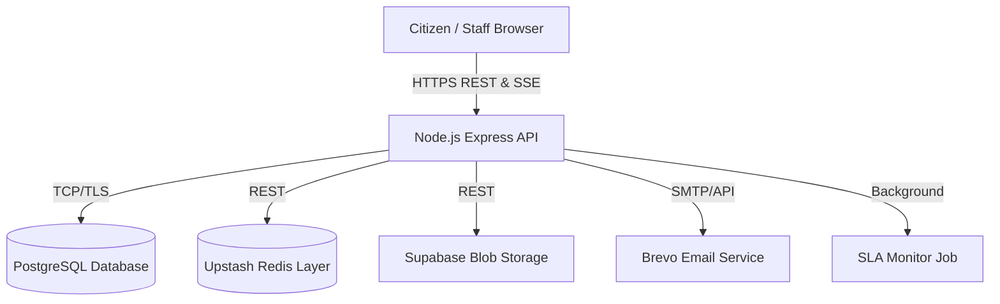
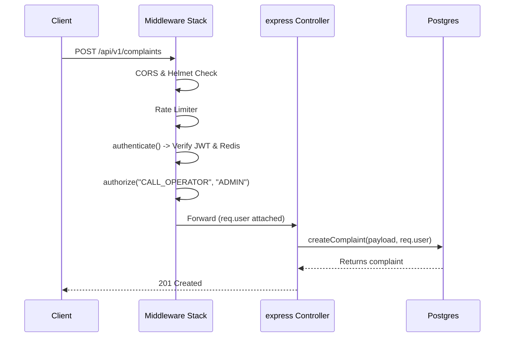

# P-CRM Platform — System Architecture & Data Flow

This document provides a highly detailed explanation of the P-CRM platform's technical architecture, system components, request lifecycles, and data flows.

---

## 1. High-Level System Architecture

The P-CRM platform is built on a modern, decoupled **Client-Server Architecture** utilizing a Next.js (React) Frontend and a Node.js (Express) Backend, communicating strictly over REST APIs and Server-Sent Events (SSE).

### 1.1 Infrastructure Components

- **Frontend Layer:** Next.js 16 (App Router) deployed on Edge network (e.g., Vercel). Responsible for UI rendering, local state management (Zustand/React context), and server-state caching (TanStack Query).
- **API Gateway / Application Server:** Node.js 22 + Express 5 application running on cloud container instances (e.g., Vercel, Render, AWS ECS). Handles all business logic, routing, auth, and AI orchestration.
- **Transact Persistence (DB):** PostgreSQL (Neon/Supabase) via Prisma ORM for relational, structured system data (Users, Complaints, Tenants).
- **Ephemeral / Cache Store:** Upstash Redis serving as a fast-access lock layer (JWT Blacklist) and query cache.
- **Blob Storage:** Supabase Storage (S3-compatible API) serving as the persistence layer for complaint attachments (PDFs, Images).
- **Background Runner:** Node.js setInterval / background processes running async cron jobs (SLA monitoring, escalation logic).
- **External Integrations:**
  - **Brevo API:** Transactional email delivery.
  - **Gemini / Local AI Pipeline:** Execution engine for sentiment analysis and NLP priority prediction.



---

## 2. Core Request Lifecycle & Middleware Flow

When an HTTP request enters the backend, it traverses a strict, layered middleware pipeline before hitting any controller logic. This ensures security, rate-limiting, and payload sanitization are handled centrally.

### 2.1 The Request Pipeline

1. **Edge Router Layer (Nginx/Cloudflare):** Terminates TLS, basic DDoS mitigation.
2. **Security Headers (Helmet):** Injects `X-Frame-Options`, `Content-Security-Policy`, etc.
3. **CORS Validation:** Cross-Origin Resource Sharing is validated against the `FRONTEND_URL`. Disallows unknown callers.
4. **Body Parsing:** `express.json` / `express.urlencoded` parse the payload (capped at 10kb to prevent payload exhaustion).
5. **Rate Limiting:** `globalLimiter` restricts raw request volume (e.g., 500 requests / 15 mins per IP). Distinct endpoints (like Login, Forgotten Password) have tighter `express-rate-limit` thresholds.
6. **Authentication Filter:**
   - The `authenticate` middleware intercepts the request.
   - Extracts the JWT `accessToken` from httpOnly cookies.
   - Verifies the signature using `JWT_SECRET`.
   - Checks the Redis cache to ensure the token's `jti` (JWT ID) was not blacklisted (e.g., due to user logout).
   - If valid, injects `req.user` (containing `userId`, `tenantId`, `role`).
7. **Authorization Guard (RBAC):** `authorize(...roles)` checks if `req.user.role` matches allowed roles for the endpoint.
8. **Controller Execution:** The actual route handler executes inside an `asyncHandler` wrapper which routes any exceptions directly to the Error Middleware.



---

## 3. Data Isolation Architecture (Multi-Tenancy)

A major architectural pillar of P-CRM is **Tenant Data Isolation**. The system logic strictly partitions data meaning User A from Tenant X can never accidentally view Complaint B from Tenant Y.

### 3.1 Logical DB Partitioning

All top-level tables (`Users`, `Complaints`, `Departments`, `AuditLogs`) have a `tenantId` foreign key. We employ an application-level strict isolation pattern.

### 3.2 ForTenant Guard

Inside API service files, Prisma queries are _never_ run without a scoping parameter. The `forTenant(user)` and `inTenant(user)` utilities automatically construct `{ tenantId: user.tenantId }` objects.

```typescript
// BAD: Prone to IDOR
const dept = await prisma.department.findUnique({
  where: { id: req.params.id },
});

// GOOD: Tenant-Scoped Query Pattern
const dept = await prisma.department.findFirst({
  where: {
    id: req.params.id,
    ...forTenant(user),
  },
});
```

### 3.3 Attribute-Based Access Control (ABAC) Layer

On top of tenant isolation, the system narrows data visibility based on role (ABAC).

- `CALL_OPERATOR`: Can only manage complaints where `createdById === userId`.
- `OFFICER`: Can only view complaints where `assignedToId === userId`.
- `DEPARTMENT_HEAD`: Can view all complaints where `departmentId === user.departmentId`.
- `ADMIN / SUPER_ADMIN`: Enjoys global visibility inside their tenant constraints.

---

## 4. Intelligent Workflow Automation (The AI Engine)

P-CRM doesn't just store grievance logic; it auto-categorizes and enriches context asynchronously behind the scenes.

1. **Intake Queueing:** When a citizen or Call Operator files a complaint, core data is saved to PostgreSQL instantly for low-latency response.
2. **Asynchronous Dispatch:** The `ai.service.js` engines run immediately post-creation:
   - **Engine 1 - Sentiment Check:** Lexicon-based scanning assesses distress markers (e.g., "dying", "urgent") and outputs a confidence score (-1 to +1).
   - **Engine 2 - Priority Inference:** Adjusts the default "LOW/MEDIUM" priority upward automatically if critical infrastructure keywords (e.g., "pipe burst") are detected in context.
   - **Engine 3 - Duplicate Trap (Jaccard Similarity):** Compares text against all recent unresolved complaints in the same tenant to calculate overlap percentage. If `score > threshold`, flags as duplicate.
3. **Score Write-back:** AI scores are updated on the original record.

---

## 5. Background Jobs & State Transitions

P-CRM utilizes finite state machinery for complaint lifecycles combined with Cron background workers.

### 5.1 The Status Engine (FSM)

Transitions are strictly governed. A complaint cannot dynamically leap from `OPEN` to `CLOSED`. It must cycle through:
`OPEN` → `ASSIGNED` → `IN_PROGRESS` → `RESOLVED` → `CLOSED`.
An edge transition to `ESCALATED` can only occur from `OPEN`, `ASSIGNED` or `IN_PROGRESS`.

### 5.2 The SLA Monitor Clock Loop

Instead of evaluating SLAs on read (which is expensive), we use an active background watcher hook (`slaMonitor.job.js`).

1. Every `30 minutes`, the server triggers `tick()`.
2. Queries the DB: Find all complaints where `slaDeadline < NOW()` & `status NOT IN [RESOLVED, CLOSED]`.
3. For each hit:
   - Updates status to `ESCALATED`.
   - Records transition in `ComplaintStatusHistory` mapping `changedById: null` to designate a System Action.
   - Fires an async event to `NotificationService` and `EmailService`.
   - Pushes an SSE event payload to live clients to refresh their dashboard immediately.

---

## 6. Frontend Token Management & Interceptor Architecture

On the client side, P-CRM's interaction with the backend requires robust session state handling due to our silent JWT rotation mechanism.

### 6.1 The Axios Interceptor Flow

Since Access Tokens expire quickly (e.g., 15m), the frontend ensures a seamless experience using an Axios response interceptor inside `lib/api.ts` coupled with TanStack Query.

- User performs action (e.g., `GET /analytics`).
- If token is expired, backend throws `401 Unauthorized`.
- Axios Interceptor captures the `401`.
- **Silent Refresh Call:** The interceptor parks the original request, calls `POST /api/v1/auth/refresh-token` instantly (sending the `httpOnly` refresh token).
- Backend returns a fresh Session Cookie.
- Interceptor replays the parked `GET /analytics` request transparently. The user never notices a failure.

---

## 7. Real-time Event Streaming (SSE)

Instead of relying on heavy WebSocket infrastructure or resource-draining HTTP Polling, P-CRM employs Server-Sent Events (SSE) for unidirectional real-time data flow (Server-to-Client).

### 7.1 Lifecycle

1. The frontend (`React Query / useEffect`) mounts and establishes a connection to `GET /notifications/stream`.
2. The browser keeps the HTTP connection open (`Connection: keep-alive`).
3. The server adds the connected client's `<Res>` object to an in-memory `Map<UserId, Set<Response>>`.
4. The server runs a heartbeat (`30s` interval) to flush out dead proxy connections.
5. When a background event occurs (e.g., SLA breach), `sendToUser(userId, data)` writes a payload chunk directly to the parked connection.
6. The frontend's `EventSource API` fires `onmessage`, pushing a toast notification and triggering TanStack Query to `invalidateQueries(["notifications"])` directly.

This creates the "Apple/Google notification" effect seamlessly without heavy Websocket payloads.

---

## 8. Database Architecture (Prisma/PostgreSQL)

P-CRM utilizes PostgreSQL governed by Prisma ORM.

### 8.1 Schema Design Principles

- **Global Identifiers:** All core tables utilize CUIDs (`cuid()`) as primary keys instead of auto-incrementing integers, preventing enumeration attacks across API boundaries.
- **Foreign Key Constraints vs Action Denials:** Referential integrity is hard-enforced. For example, assigning a non-existent `departmentId` constraint to a user throws an immediate database-level exception.
- **Soft Deletion Pattern:** Instead of hard-deleting records, models implement an `isDeleted` boolean field. Middleware and repository layer queries always append `where: { isDeleted: false }` to prevent accidental destructive queries.
- **Query Optimization & Compound Indexing:** Key tables implement compound indexes to optimize specific query paths:
  ```prisma
  @@index([tenantId, status]) // Accelerates SLA monitor searches
  @@index([tenantId, createdAt]) // Accelerates analytical dashboard aggregations
  @@index([tenantId, assignedToId]) // Accelerates officer pipeline queries
  ```
